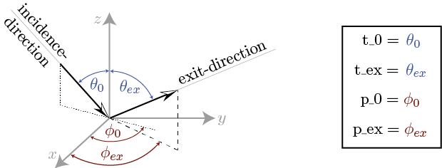

.. _cha_model_specification:

Model Specification
====================

TBD: some more cross references to the literature would be good as well, but has lower priority I would say.

Evaluation Geometries
----------------------
.. role:: latex(raw)
   :format: latex

From the general definition of the fn-coefficients :eq:`fn_coef_definition` it is apparent that they are in principle dependent on :math:`\theta_0,\phi_0,\theta_{ex}` and :math:`\phi_{ex}`.
If the series-expansions (:eq:`brdf_expansion` and :eq:`p_expansion`) contain a high number of Legendre-polynomials, the resulting fn-coefficients turn out to be rather lengthy and moreover their evaluation might consume a lot of time.
Since usually one is only interested in an evaluation with respect to a specific (a-priori known) geometry of the measurement-setup, the rt1-module incorporates a parameter that allows specifying the 
geometry at which the results are being evaluated. This generally results in a considerable speedup for the fn-coefficient generation.

The measurement-geometry is defined by the value of the :code:`geometry`-parameter of the RT1-class object:

.. code::

    R = RT1(... , geometry = '????')

The :code:`geometry`-parameter must be a **4-character string** that can take one of the following possibilities:

    - :code:`'mono'` for `Monostatic Evaluation`_
    - any combination of :code:`'f'` and :code:`'v'` for `Bistatic Evaluation`_

To clarify the definitions, the used angles are illustrated in :numref:`evaluation_angles`.

.. _evaluation_angles:

   Illustration of the used incidence- and exit-angles

Monostatic Evaluation
''''''''''''''''''''''

Monostatic evaluation refers to measurements where both the
transmitter and the receiver are at the same location.

In terms of spherical-coordinate description, this is equal to (see :numref:`evaluation_angles`):

.. math::
    \theta_{ex} &= \theta_0 \\
    \phi_{ex} &= \phi_0 + \pi

Since a monostatic setup drastically simplifies the evaluation of the fn-coefficients,
setting the module exclusively to monostatic evaluation results in a considerable speedup.

The module is set to be evaluated at monostatic geometry by setting:

.. code::

    R = RT1(... , geometry = 'mono')

.. note::
	- If :code:`geometry` is set to :code:`'mono'`, the values of :code:`t_ex` and :code:`p_ex` have no effect on the calculated results since they are automatically set to :code:`t_ex = t_0` and :code:`p_ex = p_0 + Pi`
	- For azimuthally symmetric phase-functions [#]_, the value of :code:`p_0` has no effect
	  on the calculated result and the best performance will be achieved by setting :code:`p_0 = 0.`

.. [#] This referrs to any phase-function whose generalized scattering angle parameters satisfy :code:`a[0] = ?, a[1] == a[2] = ?`. The reason for this simplification stems from the fact that the azimuthal dependency of a generalized scattering angle with :code:`a[1] == a[2]` can be expressed in terms of :math:`\cos(\phi_0 - \phi_{ex})^n`. For the monostatic geometry this reduces to :math:`\cos(\pi)^n = 1` independent of the choice of :math:`\phi_0`.

Bistatic Evaluation
''''''''''''''''''''

Any possible bistatic measurement geometry can be chosen by manually selecting the
angles that shall be treated symbolically (i.e. variable), and those that are treated as numerical constants (i.e. fixed).

The individual characters of the :code:`geometry`-string hereby represent
the properties of the incidence- and exit angles (see :numref:`evaluation_angles`) in the order of appearance within the RT1-class element, i.e.:

.. code::

	geometry[0] ...	t_0
	geometry[1] ... t_ex
	geometry[2] ... p_0
	geometry[3] ... p_ex

- The character :code:`'f'` indicates a **fixed** angle
	- The given numerical value of the angle will be used rather than it's
	  symbolic representation to speed up evaluation.
	- The resulting fn-coefficients are only valid for the chosen specific value of the angle.

- The character :code:`'v'` indicates a **variable** angle
	- The angle will be treated symbolically when evaluating the fn-coefficients
	  in order to provide an analytic representation of the interaction-term
	  where the considered angle is treated as a variable.
	- The resulting fn-coefficients can be used for any value of the angle.

As an example, the choice :code:`geometry = 'fvfv'` represents a measurement setup where the surface is illuminated at
constant (polar- and azimuth) incidence-angles and the location of the receiver is variable both in azimuth- and polar direction.

.. note::
	- Whenever a single angle is set *fixed*, the calculated fn-coefficients are only valid for this specific choice!
	- If the chosen scattering-distributions reqire an approximation with a high degree of Legendre-polynomials, evaluating
	  the interaction-contribution with :code:`geometry = 'vvvv'` might take considerable time since the resulting fn-coefficients
	  are very long symbolic expressions.

Linear combination of scattering distributions
---------------------------------------------

Aside of directly specifying the scattering distributions by choosing one of the implemented functions, the RT1-module has
a method to define linear-combinations of scattering distributions to allow consideration of more complex scattering characteristics.

   An IPython-notebook that shows the basic usage of linear-combinations within the RT1-module is provided `HERE <https://github.com/pygeo/rt1/tree/master/doc/examples/example_lin_comb.ipynb>`_ .

Combination of volume-scattering phase-functions
''''''''''''''''''''''''''''''''''''''''''''''''''

Linear-combination of volume-scattering phase-functions is used to generate a combined volume-class element of the form:

.. math::

   \hat{p}_{combined}(\theta_0,\phi_0,\theta_{ex},\phi_{ex}) = \sum_{n=0}^N  w_n * \hat{p}_n(\cos(\Theta_{a_n}))
   = \sum_{n=0}^N w_n * \sum_{k=0}^{K_n} \hat{P}_k(\cos(\Theta_{a_n})) * p^{(n)}_k

where :math:`\hat{p}_n(\cos(\Theta_{a_n}))` denotes the scattering phase-functions to be combined, :math:`\cos(\Theta_{a_n})` denotes the individual scattering angles :eq:`general_scat_angle` used to define the 
scattering phase-functions :math:`w_n` denotes the associated weighting-factors, :math:`p_k^{(n)}` denotes the :math:`\textrm{k}^{\textrm{th}}` Legendre-expansion-coefficient :eq:`p_expansion` of the 
:math:`\textrm{n}^{\textrm{th}}` phase-function and :math:`\hat{P}_k(x)` denotes the :math:`\textrm{k}^{\textrm{th}}` Legendre-polynomial.

.. note::

   Since a volume-scattering phase-function must obey the normalization condition:

   .. math::

      \int_0^{2\pi}\int_0^{\pi} \hat{p}(\theta,\phi,\theta',\phi') \sin(\theta') d\theta' d\phi' = 1

   and each individual phase-function that is combined already satisfies this condition,
   the weighting-factors :math:`w_n` must equate to 1, i.e.:

   .. math::

	  \sum_{n=0}^N w_n = 1

Within the RT1-module, linear-combination of volume-scattering phase-functions is performed by the :code:`LinCombV(omega, tau, Vchoices)` function:

.. code::

   from rt1.volume import LinCombV

In order to generate a combined phase-function, one must provide the optical depth :code:`tau`, the single-scattering albedo :code:`omega`
and a list of volume-class elements along with a set of weighting-factors (:code:`Vchoices`) of the form:

.. code::

  Vchoices = [ [weighting-factor , function] , [weighting-factor , function] , ...  ]

Once the functions and weighting-factors have been defined, the combined phase-function is generated via:

.. code::

   V = LinCombV(tau, omega, Vchoices)

The resulting volume-class element can now be used completely similar to the pre-defined scattering phase-functions.

.. note::

   Since one can combine functions with different choices for the generalized scattering angle (i.e. the :code:`a`-parameter),
   and different numbers of expansion-coefficients (the :code:`ncoefs`-parameter) :code:`LinCombV()` will automatically combine
   the associated Legendre-expansions based on the choices for :code:`a` and :code:`ncoefs`.

   The parameters :code:`V.a`, :code:`V.scat_angle()` and :code:`V.ncoefs` of the resulting volume-class element are therefore **NOT** representative for the generated combined phase-function!

Combination of BRDF's
''''''''''''''''''''''

Linear-combination of BRDF's is used to generate a combined surface-class element of the form:

.. math::

   BRDF_{combined}(\theta_0,\phi_0,\theta_{ex},\phi_{ex}) = \sum_{n=0}^N  w_n * BRDF_n(\cos(\Theta_{a_n}))
   = \sum_{n=0}^N w_n * \sum_{k=0}^{K_n} \hat{P}_k(\cos(\Theta_{a_n})) * b^{(n)}_k

where :math:`BRDF_n(\cos(\Theta_{a_n}))` denotes the BRDF's to be combined, :math:`\cos(\Theta_{a_n})` denotes the individual scattering angles :eq:`general_scat_angle` used to define the 
BRDF's :math:`w_n` denotes the associated weighting-factors, :math:`b_k^{(n)}` denotes the :math:`\textrm{k}^{\textrm{th}}` Legendre-expansion-coefficient :eq:`brdf_expansion` of the 
:math:`\textrm{n}^{\textrm{th}}` BRDF and :math:`\hat{P}_k(x)` denotes the :math:`\textrm{k}^{\textrm{th}}` Legendre-polynomial.

.. note::
   Since a BRDF must obey the following normalization condition:

   .. math::

      \int_0^{2\pi}\int_0^{\pi/2} BRDF(\theta,\phi,\theta',\phi') \cos(\theta') \sin(\theta') d\theta' d\phi' = R(\theta_0,\phi_0) \leq 1

   there is in principle no restriction on the weighting-factors for combination of BRDF's!

   It is however important to notice that the associated hemispherical reflectance :math:`R(\theta_0,\phi_0)` must always be lower or equal to 1.
   In order to provide a simple tool that allows validating the above condition, the function :code:`RT1.Plots().hemreflect()` numerically evaluates 
   the hemispherical reflectance using a simple Simpson-rule integration-scheme and generates a plot that displays :math:`R(\theta_0,\phi_0)`.

Within the RT1-module, linear-combination of BRDF's is performed by the :code:`LinCombSRF(omega, tau, SRFchoices)` function:

.. code::

   from rt1.surface import LinCombSRF

In order to generate a combined phase-function, one must provide a list of surface-class elements along with a set of weighting-factors (:code:`SRFchoices`) of the form:

.. code::

  SRFchoices = [ [weighting-factor , function] , [weighting-factor , function] , ...  ]

Once the functions and weighting-factors have been defined, the combined BRDF is generated via:

.. code::

   SRF = LinCombSRF(SRFchoices)

The resulting surface-class element can now be used completely similar to the pre-defined BRDF's.

.. note::

   Since one can combine functions with different choices for the generalized scattering angle (i.e. the :code:`a`-parameter),
   and different numbers of expansion-coefficients (the :code:`ncoefs`-parameter) :code:`LinCombSRF()` will automatically combine
   the associated Legendre-expansions based on the choices for :code:`a` and :code:`ncoefs`.

   The parameters :code:`SRF.a`, :code:`SRF.scat_angle()` and :code:`SRF.ncoefs` of the resulting surface-class element are therefore **NOT** representative for the generated combined BRDF!

Current limitations
--------------------

TBD
- currently no delta functions implemented as BRDF or p
- numerical prescision issues for ncoefs > 20

+ add references to literature