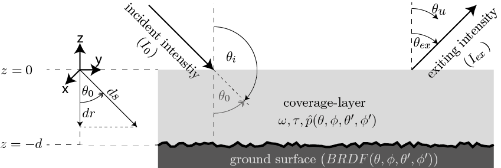

Theory
======

The RT1 module provides a method for calculating the scattered radiation from a 
uniformly illuminated rough surface covered by a homogeneous layer of tenuous media.
The following sections are intended to give a general overview of the underlying theory of the
RT1 module. A more general discussion on the derivation of the used results can be found in [QuWa16]_.
Details on how to define the scattering properties of the covering layer and the ground surface
within the RT1-module are given in :ref:`cha_model_specification`.

The utilized theoretical framework is based on applying the Radiative Transfer Equation (RTE) :eq:`RTE` to 
the geometry shown in :numref:`problem_geometry`.

.. math::
   \cos(\theta) \frac{\partial I_f(r,\theta,\phi)}{\partial r} = -\kappa_{ex} I_f(r,\theta,\phi)
   + \kappa_s \int\limits_{0}^{2\pi}\int\limits_{0}^{\pi/2} I_f(r,\theta',\phi') \hat{p}(\theta,\phi,\theta',\phi') \sin(\theta') d\theta' d\phi'
   :label: RTE

The individual variables are hereby defined as follows:

- :math:`\theta` denotes the polar angle in a spherical coordinate system
- :math:`\phi` denotes the azimuth angle in a spherical coordinate system
- :math:`r` denotes the distance within the covering layer
- :math:`I_f(r,\theta,\phi)` denotes the specific intensity at a distance :math:`r` within the covering layer propagating in direction :math:`(\theta,\phi)`.
- :math:`\kappa_{ex}` denotes the extinction-coefficient (i.e. extinction cross section per unit volume)
- :math:`\hat{p}(\theta,\phi,\theta',\phi')` denotes the scattering phase-function of the constituents of the covering layer

.. note::
	To remain consistent with [QuWa16]_, the arguments of the functions :math:`\hat{p}(\theta,\phi,\theta',\phi')` and :math:`BRDF(\theta,\phi,\theta',\phi')` are defined as angles 
	with respect to a spherical coordinate system in the following discussion. Within the RT1-module however, the functions are defined with respect to the associated zenith-angles!
 
	A relationship between the module-functions and the functions within the subsequent discussion is therefore given by:
 
	:code:`SRF.brdf(t_0,t_ex,p_0,p_ex)` :math:`\hat{=} ~BRDF(\pi - \theta_0, \phi_0, \theta_{ex},\phi_{ex}) \quad` and :math:`\mbox{}\quad` :code:`V.p(t_0,t_ex,p_0,p_ex)` :math:`\hat{=} ~\hat{p}(\pi - \theta_0, \phi_0, \theta_{ex},\phi_{ex})`

 

Problem Geometry and Boundary Conditions
-----------------------------------------

.. _problem_geometry:

   Illustration of the chosen geometry within the RT1-module (adapted from [QuWa16]_)

As shown in :numref:`problem_geometry`, the considered problem geometry is defined as a rough surface covered by a homogeneous layer of a scattering and absorbing medium.

In order to be able to solve the RTE :eq:`RTE`, the boundary-conditions are specified as follows:

- The top of the covering layer is uniformly illuminated at a single incidence-direction:

.. math::
      I_0(z=0,\theta,\phi) = \frac{I_0}{\sin(\theta)}	\delta(\theta - \theta_i) \delta(\phi - \phi_i)

- Radiation impinging at the ground surface is reflected upwards according to its associated Bidirectional Reflectance Distribution Function (BRDF)

.. math::
   I^+(z=-d, \theta, \phi) = \int_{0}^{2\pi} \int_{0}^{\pi} I^-(z=-d, \theta, \phi) BRDF(\theta,\phi,\theta',\phi') \sin(\theta') d\theta' d\phi'

The superscripts :math:`I^\pm` hereby indicate a separation between upwelling :math:`(+)` and downwelling :math:`(-)` intensity.

The additional specifications of the covering layer and the ground surface are summarized as follows:

   
Parameters used to describe the scattering properties of the covering layer
''''''''''''''''''''''''''''''''''''''''''''''''''''''''''''''''''''''''''''

**Scattering Phase Function:**
(i.e. *normalized differential scattering cross section*)

.. math::
   \hat{p}(\theta,\phi,\theta',\phi') \qquad \textrm{with} \qquad   \int\limits_0^{2\pi} ~ \int\limits_{0}^{\pi} \hat{p}(\theta,\phi,\theta',\phi') \sin(\theta') d\theta' d\phi' = 1
   
**Optical Depth:**

.. math::
   \tau = \kappa_{ex} ~ d = (\kappa_{s} + \kappa_{a}) ~ d

where :math:`\kappa_{ex}` is the *extinction coefficient* (i.e. extinction cross section per unit volume)
, :math:`\kappa_{s}` is the *scattering coefficient* (i.e. scattering cross section per unit volume)
, :math:`\kappa_{a}` is the *absorption coefficient* (i.e. absorption cross section per unit volume)
and :math:`d` is the *total height of the covering layer*.

**Single Scattering Albedo:**

.. math::
   \omega = \frac{\kappa_{s}}{\kappa_{ex}} = \frac{\kappa_{s}}{\kappa_{s} + \kappa_{a}}   \leq 1

Parameters used to describe the scattering properties of the ground surface
''''''''''''''''''''''''''''''''''''''''''''''''''''''''''''''''''''''''''''

**Bidirectional Reflectance Distribution Function:**

.. math::
   BRDF(\theta,\phi,\theta',\phi')  \qquad \textrm{with} \qquad   \int\limits_0^{2\pi} ~ \int\limits_{0}^{\pi/2} BRDF(\theta,\phi,\theta',\phi') \cos(\theta') \sin(\theta') d\theta' d\phi' = R(\theta,\phi) \leq 1

where :math:`R(\theta,\phi)` denotes the **Directional-Hemispherical Reflectance** of the ground surface.

TBD: perhaps describe also normalization conditions for p and BRDF
   
First-order solution to the RTE
--------------------------------

Incorporating the above specifications, a solution to the RTE is obtained by assuming that the scattering coefficient :math:`\kappa_s` of the covering layer is small (i.e. :math:`\kappa_s\ll 1`).
Using this assumption, the RTE is expanded into a series with respect to powers of :math:`\kappa_s`, given by:

.. math::
   I^+ = I_{\textrm{surface}} + I_{\textrm{volume}} + I_{\textrm{interaction}} + (I_{svs}) + \mathcal{O}(\kappa_s^2)

where the individual terms (representing the contributions to the scattered intensity at the top of the covering layer)  can be interpreted as follows:

- :math:`I_{\textrm{surface}}`:  radiation scattered once by the ground surface
- :math:`I_{\textrm{volume}}`: radiation scattered once within the covering layer
- :math:`I_{\textrm{interaction}}`: radiation scattered once by the ground surface and once within the covering layer
- :math:`I_{svs}`: radiation scattered twice by the ground surface and once within the covering layer
      (This contribution is assumed to be negligible due to the occurrence of second order surface-scattering) 

After some algebraic manipulations the individual contributions are found to be given by (details can be found in [QuWa16]_):

.. math::
   I_{\textrm{surface}}(\theta_0, \phi_0, \theta_{ex}, \phi_{ex}) = I_0 e^{-\frac{\tau}{\cos(\theta_0)}} ~ e^{-\frac{\tau}{\cos(\theta_{ex})}} \cos(\theta_0) BRDF(\pi-\theta_0, \phi_0, \theta_{ex}, \phi_{ex})

.. math::
   I_{\textrm{volume}}(\theta_0, \phi_0, \theta_{ex}, \phi_{ex}) = I_0 ~\omega ~ \frac{\cos(\theta_0)}{\cos(\theta_0) + \cos(\theta_{ex})} \left( 1 - e^{-\frac{\tau}{\cos(\theta_0)}} ~ e^{-\frac{\tau}{\cos(\theta_{ex})}}  \right)    \hat{p}(\pi-\theta_0, \phi_0, \theta_{ex}, \phi_{ex})

.. math::
   I_{\textrm{interaction}}(\theta_0, \phi_0, \theta_{ex}, \phi_{ex}) = I_0 ~ \cos(\theta_0) ~ \omega \left\lbrace e^{-\frac{\tau}{\cos(\theta_{ex})}} F_{int}(\theta_0,\theta_{ex}) + e^{-\frac{\tau}{\cos(\theta_{ex})}} F_{int}(\theta_{ex},\theta_{0})    \right\rbrace

.. math::
   \textrm{with} \qquad \qquad F_{int}(\theta_0, \phi_0, \theta_{ex}, \phi_{ex}) = \int\limits_0^{2\pi} \int\limits_0^\pi   \frac{\cos(\theta)}{\cos(\theta_0)-\cos(\theta)} \left( e^{-\frac{\tau}{\cos(\theta_0)}} - e^{-\frac{\tau}{\cos(\theta)}} \right) ~ \hat{p}(\theta_0, \phi_0, \theta , \phi) BRDF(\pi - \theta, \phi, \theta_{ex}, \phi_{ex})  \sin(\theta) d\theta d\phi

Evaluation of the interaction-contribution
-------------------------------------------

In order to analytically evaluate the remaining integral appearing in the interaction-term, the BRDF and the scattering phase-function of the covering layer are approximated via a 
Legendre-series in a (possibly generalized) scattering angle of the form:

.. math::
   BRDF(\theta, \phi, \theta_{s}, \phi_{s}) = \sum_{n=0}^{N_b} b_n P_n(\cos(\Theta_{a_b})) 
   :label: brdf_expansion

.. math::
   \hat{p}(\theta, \phi, \theta_{s}, \phi_{s}) = \sum_{n=0}^{N_p} p_n P_n(\cos(\Theta_{a_p})) 
   :label: p_expansion
   
where :math:`P_n(x)` denotes the :math:`\textrm{n}^\textrm{th}` Legendre-polynomial and the generalized scattering angle :math:`\Theta_a` is defined via:

.. math::
   \cos(\Theta_a) = a_0 \cos(\theta) \cos(\theta_{s}) + \sin(\theta) \sin(\theta_{s}) \left[a_1 \cos(\phi) \cos(\phi_{s}) + a_2 \sin(\phi) \sin(\phi_{s}) \right]
   :label: general_scat_angle

where :math:`\theta ,\phi` are the polar- and azimuth-angles of the incident radiation, :math:`\theta_{s}, \phi_{s}` are the polar- and azimuth-angles of the scattered radiation and :math:`a_1,a_2` and :math:`a_3`
are constants that allow consideration of off-specular and anisotropic effects within the approximations.

 
Once the :math:`b_n` and :math:`p_n` coefficients are known, the method developed in [QuWa16]_ is used to analytically solve :math:`I_{\textrm{interaction}}`.

This is done in two steps:

First, the so-called fn-coefficients are evaluated which are defined via:

.. math::
   \int_{0}^{2\pi} \hat{p}(\theta_0,\phi_0,\theta,\phi)BRDF(\pi - \theta, \phi, \theta_{ex},\phi_{ex}) d\phi  = \sum_{n=0}^{N_b + N_p} f_n(\theta_0,\phi_0,\theta_{ex},\phi_{ex}) \cos(\theta)^n
   :label: fn_coef_definition

Second, :math:`I_{\textrm{interaction}}` is evaluated using the analytic solution to the remaining :math:`\theta`-integral for a given set of fn-coefficients as presented in [QuWa16]_.

.. topic:: Example

	In the following, a simple example on how to evaluate the fn-coefficients is given.
	The ground is hereby defined as a Lambertian-surface and the covering layer is assumed to consist of Rayleigh-particles. Thus, we have: (:math:`R_0` hereby denotes the diffuse albedo of the surface)

	- :math:`BRDF(\theta, \phi, \theta_{ex},\phi_{ex}) = \frac{R_0}{\pi}`
	- :math:`p(\theta, \phi, \theta_{ex},\phi_{ex}) = \frac{3}{16\pi} (1+\cos(\Theta)^2) \quad` with :math:`\mbox{}\quad` :math:`\cos(\Theta) = \cos(\theta)\cos(\theta_{ex}) + \sin(\theta)\sin(\theta_{ex})\cos(\phi - \phi_{ex})`

	.. math::
	   INT &= \int_0^{2\pi} p(\theta_0, \phi_0, \theta,\phi) * BRDF(\pi-\theta, \phi, \theta_{ex},\phi_{ex}) d\phi
	   \\ &= \frac{3 R_0}{16 \pi^2} \int\limits_{0}^{2\pi}  (1+[\cos(\theta_0)\cos(\theta) + \sin(\theta_0)\sin(\theta)\cos(\phi_0 - \phi)]^2) d\phi
	   \\ &= \frac{3 R_0}{16 \pi^2} \int\limits_0^{2\pi} (1+ \mu_0^2 \mu^2 + 2 \mu_0 \mu \sin(\theta_0) \sin(\theta) \cos(\phi_0 - \phi) + (1-\mu_0)^2(1-\mu)^2 \cos(\phi_0 - \phi)^2 d\phi

	where the shorthand-notation :math:`\mu_x = \cos(\theta_x)` has been introduced.

	The above integral can now easily be solved by noticing:

	.. math::
	   \int\limits_0^{2\pi} \cos(\phi_0 - \phi)^n d\phi = \left\lbrace \begin{matrix} 2 \pi & \textrm{for } n=0 \\ 0 & \textrm{for } n=1 \\ \pi  & \textrm{for } n=2 \end{matrix} \right.

	Using some algebraic manipulations we therefore find:

	.. math::
	   INT = \frac{3 R_0}{16\pi} \Big[ (3-\mu_0^2) + (3 \mu_0 -1) \mu^2 \Big] = \sum_{n=0}^2 f_n ~ \mu^n
	   \\ \\
	   \Rightarrow \quad f_0 = \frac{3 R_0}{16\pi}(3-\mu_0^2) \qquad f_1 = 0 \qquad f_2 = \frac{3 R_0}{16\pi}(3 \mu_0 -1) \qquad f_n = 0 ~ \forall ~n>2

     An IPython-notebook that uses the RT1-module to evaluate the above fn-coefficients can be found `HERE <https://github.com/pygeo/rt1/tree/master/doc/examples/example_fn.ipynb>`_

.. rubric:: References
.. [QuWa16]  R.Quast and W.Wagner, "Analytical solution for first-order scattering in bistatic radiative transfer interaction problems of layered media," Appl.Opt.55, 5379-5386 (2016) 
